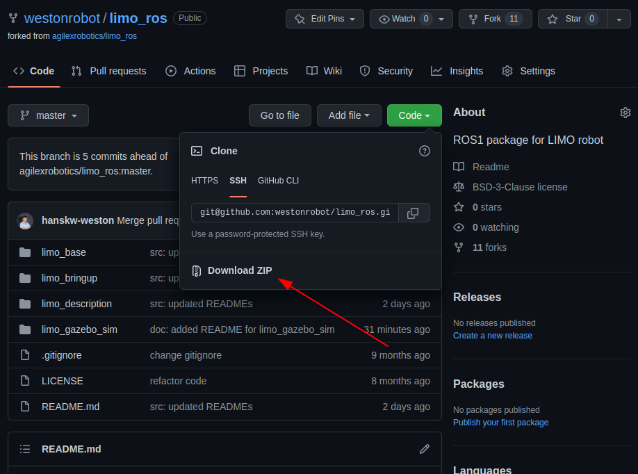

**Lab 2 submission due on 22<sup>nd</sup> May 2022, 23:59**{: .label .label-red }
# Prelab (1%)

We will have a short quiz on concepts that have been covered in the lecture and those that will be needed during this lab session.
It will be in a short-form open-ended answer format, and concepts covered will be from the readings found below.

**Readings**
1. [ROS - Understanding Nodes](http://wiki.ros.org/ROS/Tutorials/UnderstandingNodes)
2. [ROS - Understanding Topics](http://wiki.ros.org/ROS/Tutorials/UnderstandingTopics)
3. [Linux - Ifconfig](https://www.computerhope.com/unix/uifconfi.htm)
4. [Python - Basics Tutorial](https://www.tutorialspoint.com/python/index.htm)

## Setup
* Be in your teams of 5
* Steps should be performed by all **group members individually**.
* You can share observation data, but not explanations, code or deductions for the lab report

## Lab Report and Submission
* Thoughout this lab, there are tasks that you are supposed to perform and record observations/deductions.
* Each task will be clearly labelled and will need to be included in your lab report, which is in the format "**lab2\_report\_STUDENT\_ID.doc / pdf**", include your name, student_id at the begining of the report.
* Zip up your lab report and other requirements (if present) and name it "**lab2\_STUDENT\_ID.zip**" into \_____TBC_____.

## Learning Outcomes
By the end of lab 2, you will have:
1. learnt how to setup a ROS workspace for development
2. setup a ROS package and learn testing/debugging tools
3. create your own custom ROS package

----

# Lab 2 (5%) 

## Setting up a catkin workspace for ROS development
A catkin workspace is a folder dedicated for ROS development.

1. Make sure you have sourced you ROS installation
2. Now we can create and setup out first catkin workspace, to do this we
    
    Make a folder where we want our workspace to be, (here we will make it at home and name it "catkin_ws")  
    **Note: a catkin workspace folder can be named anything and be made anywhere**

    ```bash
    $ mkdir -p ~/catkin_ws/src
    $ cd ~/catkin_ws/
    ```

    We initialize the workspace with a convenince tool, inside the catkin_ws folder we run

    ```bash
    $ catkin_make
    ```

    If succesful, the folder will now have new "build" and "devel" folders. Inside the devel folder, there is a setup.bash file we need to source to setup the environment variables.  
    **We need to do this everytime we rebuild any packages**
    
    ```bash
    $ source devel/setup.bash
    ```

    To make sure that the environment variables are setup correctly, we can check if the ROS_PACKAGE_PATH environment variable includes the directory you're in.
   
   ```bash
   $ echo $ROS_PACKAGE_PATH
   ```

3. Now, you have set up a catkin workspace for ROS development.

## Getting and Building an existing ROS package
A ROS package can be simply thought as a self contained project folder that has related code and configuration files in it.  
A package can have 1 to many different nodes within it.  
Today we will use the limo_ros package to demonstrate how to setup a ros package.
This limo_ros package is the same package contained within each limo robot IPC and the package that you guys will build your project on.

1. First we need to get the source code for the ROS package.

    The source code is contained in a github repository found [here](https://github.com/westonrobot/limo_ros).

    For those already familiar with Git, you can go ahead and clone the repository into your catkin workspace's src folder.

    For the rest, you can download a zip folder with the source code under the Code tab here and extract to your catkin workspace src folder.  
    *Do not fret!!! Git will be covered in a future lecture/lab* 

    


2. Now that we have the source code, we need to build the limo_ros package
   
   To build the package, from the base catkin workspace folder, we have to run

   ```bash
   $ catkin_make
   ```

   and after it builds successfully, we have to source devel/setup.bash

## Running a node

The limo_ros repository contains 4 packages, and details can be found in the source code folder or the github repository itself. Do familiarize yourself with this package as this package will be the basis of your coming project. But for today, we will just be taking a look at how we can run the gazebo simulation and how to tele-operate the limo from your own computer.

### Simulation
Gazebo is a simulator that enables us to simulate a close representation of the limo hardware in a virtual world. To setup and get familiar with the simulation of the limo robot, instructions can be found in the limo_gazebo_sim sub package README.md file or can be viewed on the github repository directly [here](https://github.com/westonrobot/limo_ros/tree/master/limo_gazebo_sim).

**Task 1: Running the simulation**{: .label .label-green}

   1. Using the README in the repository's , start the simulation of the limo in gazebo in  
   the 4-wheeled differential drive movement mode and control it using the twist_keyboard.
   2. Once the simulation has been started, view the resulting ROS network using rqt_graph
      1. **Task 1a**{: .label .label-blue}Take a screenshot of the network graph, include this screenshot in your report.
      2. **Task 1b**{: .label .label-blue}From this screenshot, which nodes publishes and subscribes to the "/cmd_vel" topic?

### Tele-operation

The limo_base package contains the ROS package that controls and drives the limo robot. This package is designed to work on a computer connected to the limo's on-board low-level controller thorugh a serial port. To setup and get familiar with the control node of the limo robot, instructions can be found in the limo_base sub package README.md file or can be viewed on the github repository directly [here](https://github.com/westonrobot/limo_ros/tree/master/limo_base). 

In the following task, we will attempt to control the limo using your own computer. To achieve this, we will need to run the limo_base control node on the limo itself, and make our own computer publish to the /cmd_vel topic within the same ROS network.

*Do coordinate with your team members when attempting to do this task as to avoid situations where multiple members are attempting to control the robot*

**Task 2: Tele-operating your limo**{: .label .label-green}

   1. Connect your computer to the limo's wifi.
   2. With a keyboard attached to limo's computer, find the ip address of the nano
      1.  **Task 2a**{: .label .label-blue}What's the nano's ip address?
   3. After finding the ip address
      1. add the lines below to the nano's bashrc file, replacing with the ip address you have found and source bashrc
        ```bash
        export ROS_MASTER_URI=http://<nano ip address>:11311
        export ROS_HOSTNAME=<nano ip address>
        ```
   4. Run the limo_base_node on the jetson nano computer.
   5. On your computer, find the ip address of your computer.
      1. add the lines below your own bashrc file, be mindful of which ip address you use and source the neew bashrc file
        ```bash
        export ROS_MASTER_URI=http://<nano ip address>:11311
        export ROS_HOSTNAME=<your own ip address>
        ```
   6. On your computer run the teleop twist keyboard node to publish to /cmd_vel
   7. Once the teleop twist keyboard has been started, view the resulting ROS network using rqt_graph
      1. **Task 2b**{: .label .label-blue}Take a screenshot of the network graph, include this screenshot in your report.
      2. **Task 2c**{: .label .label-blue}Where is the ROS master node running on?
      3. **Task 2d**{: .label .label-blue}From this screenshot and the bashrc files, can you deduce what does setting the ROS_MASTER_URI and ROS_HOSTNAME environment variables do?

## Making our first package
Now that we have gone through setting up, building, and running a exisitng package, we can now start making our very own custom package. This lab will cover creating the 2 most basic nodes we can have, *publishers* and *subscribers*.

1. Creating a empty catkin package
   1. Navigate to your catkin workspace's src folder in your terminal
   2. To create an empty package, run
    
        ```bash
        catkin_create_pkg beginner_tutorials std_msgs rospy roscpp
        ```
    
   3. This will create a beginner_tutorials folder which contains a package.xml and a CMakeLists.txt, which have been partially filled out with the information you gave catkin_create_pkg.

**Task 3: Creating a simple publisher and subscriber**{: .label .label-green}

1. Follow the official ROS tutorial [here](http://wiki.ros.org/ROS/Tutorials/WritingPublisherSubscriber%28python%29) to create your first publisher and subscriber nodes.
2. After creating the 2 nodes, run the 2 nodes and rqt_graph
   1. **Task 3a**{: .label .label-blue}Take a screenshot of the network graph, include this screenshot in your report.
   2. **Task 3b**{: .label .label-blue}What is the topic name these 2 nodes are communcating on and where is this defined?
   3. **Task 3c**{: .label .label-blue}What is the message data format used on this topic?
   4. **Task 3d**{: .label .label-blue}What is the frequency rate (in Hz) of publishing on this topic and how can we change this rate?

**Task 4: Implementing our own node**{: .label .label-green}

1. **Task 4a**{: .label .label-blue}Building on the publisher and subscriber package we just made, create a node that "intercepts" the original message, changes the content (anyway you like) and republishes this new message to a new topic. You can modify the 2 original nodes to publish and subscribe to any topic you like and the resultant network should look similar to the diagram below when all 3 nodes are running. Include a screenshot of the network when all 3 nodes are running.
2. **Task 4b**{: .label .label-blue}Include this final modified package alongside your report during submission.

**Before**

**After**


## Submission
Zip up your lab report and the package you have made in Task 3 and 4 into a zip file called "**lab2\_STUDENT\_ID.zip**" and submit it on to xSITe by 22<sup>nd</sup> May 2022, 23:59.
