**Lab 3 submission due on 28<sup>th</sup> May 2022, 23:59**{: .label .label-red }

## Table of contents
{: .no_toc .text-delta }

- TOC
{:toc}

# Prelab (1%)
## Before lab
1. Prepare your Github accounts
   1. Each member should have his/her own Github account
   2. *TIP for school students: you are typically eligible for Github pro for free with the [GitHub Student Developer Pack](https://education.Github.com/); along with many other perks.* ;D
2. Download and install your preferred (I)DE.
   1. For those who don't have one, [Visual Studio Code (VSCode)](https://code.visualstudio.com/) is a good place to start.
   2. VSCode has great python & ROS extensions. ;p
3. Install git onto your systems

## Start of Lab
1. We will have a short MCQ quiz on concepts that have been covered in the lecture and those that will be needed during this lab session, concepts covered will be from the readings found below.

## Readings
1. [Git - Basics Chapter 2](https://git-scm.com/book/en/v2)
2. [ROS - Understanding Services](http://wiki.ros.org/ROS/Tutorials/UnderstandingServicesParams)
3. [ROS - Creating Service & Client](http://wiki.ros.org/ROS/Tutorials/UnderstandingServicesParams)
4. [ROS - Creating Msg and Srv](http://wiki.ros.org/ROS/Tutorials/CreatingMsgAndSrv)
5. [Python - Bitwise Operators](https://www.tutorialspoint.com/python/bitwise_operators_example.htm)
6. [Python - Bin, Hex, & Octal](https://blog.finxter.com/python-conversions-decimal-binary-octal-hex/)

## Materials
1. [Git Cheatsheet](https://education.Github.com/git-cheat-sheet-education.pdf)
2. [Markdown Cheatsheet](https://enterprise.github.com/downloads/en/markdown-cheatsheet.pdf)
3. [LimoStatus Msg Protocol]({{ site.baseurl }})

----

# Setup
* Be in your teams of 5
* Steps should be performed by all **group members individually** unless told otherwise.
* You can share observation data, but not explanations, code or deductions for the lab report

## Lab Report and Submission
* Thoughout this lab, there are tasks that you are supposed to perform and record observations/deductions.
* Each task will be clearly labelled and will need to be included in your lab report, which is in the format "**lab3\_report\_STUDENT\_ID.doc / pdf**", include your name, student_id at the begining of the report.
* Zip up your lab report and other requirements (if present) and name it "**lab3\_STUDENT\_ID.zip**" and upload it.

## Learning Outcomes
By the end of lab 3, you will have:
1. learnt the basic project workflow using Git
2. experience how code collaboration works using Git
3. learnt how to implement a ROS service and client

----

# Lab 3 (5%) 

## Setting up a Github organisation
While multiple developers can work on a project in a single Github repository just fine, Github organisations take this a step further. They allow developers to share/manage access and collaborate across multiple projects/code repositories, all as a team.

Today we will start by creating your organisations, ones which you will hopefully continue to use throughout this course.

*Note: only one member of the team has to create the organisation, he/she will be the owner of said organisation. The owner will be addressed as such for the rest of the course*

1. Creating an organisation
   1. On the owner's main Github page, click the "+" tab on the top-right hand corner and   select "new organisation"
   2. There are multiple tiers of Github organisations, we will just create a free tier one for this course.
      1. For the organisation name, each team should follow the below format:
         1. RSE2107A-AY2122T3-Team-X
         2. Where X is your team number
      2. For contact email, you can use the owner's email address
      3. The organisation should belong to the owner's personal account
      4. It should look something shown below

        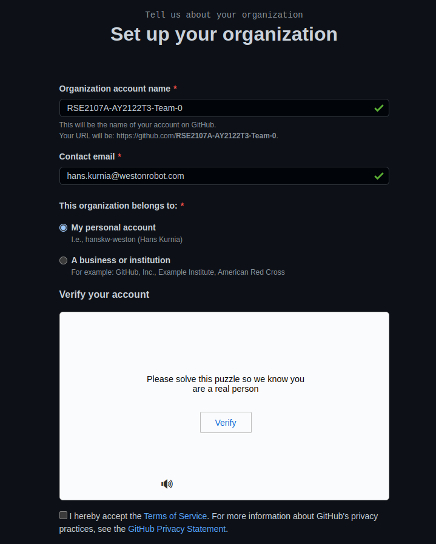

2. After creation, we need to get all team members within the same organisation
   1. From the organisation's homepage, select the "People tab".
   2. Once there, use the "invite member" button to invite each member of your team into your Github organisation as members.
   3. **IMPORTANT: To facilitate grading, do invite the following accounts to your organisation as well.**
      1. hanskw-weston
      2. Aojd22
      3. kartheegeyan
3. Congratulations, you now have a Github organisation as a team, you can explore the features and settings available to you as a organisation.
   1. *One such pertinent feature is the member privileges settings.*

## Using Git(hub) basics
From the lecture & readings, you should have a rough idea of what Git is all about and it's role in any software development project. 

Good-bye whatever this was...

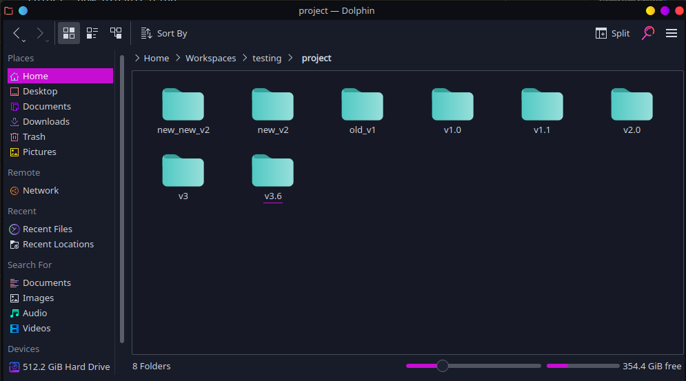

Hello ordered chaos...

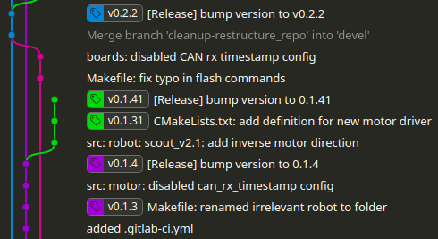

This section of the lab will walk you through a typical project workflow when collaborating on a project, from repository creation to content manipulation.

*Note: the workflow demonstrated here is commonly called a "[feature branch workflow](https://www.atlassian.com/git/tutorials/comparing-workflows/feature-branch-workflow)", which is only one of many commonly used workflows out there. While we are using this workflow in this lab, feel free to use any other workflows for your project development in the future*

### **Task 1: Working with Git solo**{: .label .label-green}
In this task, we will go through creating and commit a file to a common remote repository. This this task, you should be aware how to track changes in your repositories and how to successfully merge your changes into a single shared repository.

1. Creating a remote code repository
   1. From the owner's organisation's "Repositories" tab, click "New repository".
   2. Name this repository, "lab3-git", *check add a README file*, make it public and hit "create" (make sure the owner is the organisation).
   3. *After creating, check that every member has write access to this new repository.*
2. Cloning remote repository to make a local one
   1. Now we need each member to have a local repository to work on.
   2. From the repository's page, copy the clone url (make sure it is the SSH version) from the green "Code" button.
   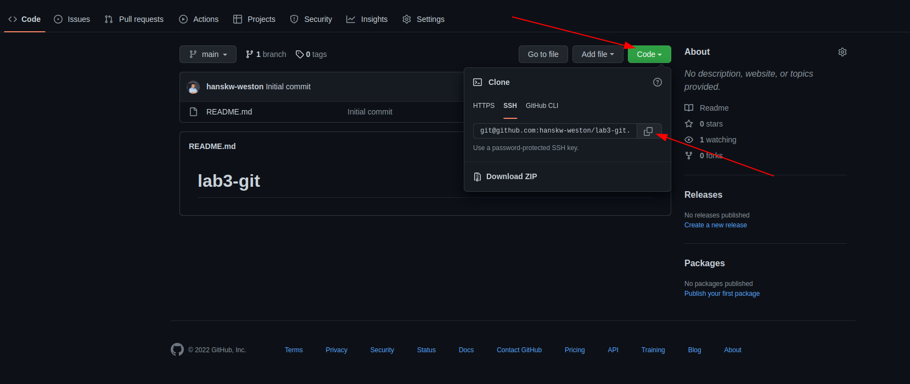
   3. On your terminal, navigate to where you would like this repository to exist and run
        ```bash
        git clone <clone url>
        ```
   4. A new local copy of the repository folder will be created in that location.
   5. **Task 1a**{: .label .label-blue}We have just created a new remote repository and cloned it into a local repository. However, we can achieve the same result if we reverse the order and make a new local repository and *pushing* it into a remote one. Can you briefly describe the process to do so? (include any commands needed)
3. Time to commit your first bit of "code"
   1. In your terminal, navigate to the "lab3-git" folder.
   2. **Task 1b**{: .label .label-blue}Once in, you can view your repository status by running the command below, include a screenshot of the output in your report.
        ```bash
        git status
        ```
   3. Create and checkout to a new branch by running the commands below (replacing the name accordingly)
        ```bash
        git branch feature_<member name>
        git checkout feature_<member name>
        ```
       1. **Task 1c**{: .label .label-blue}After checking out this new branch, check git status again and include a screenshot of the output in your report
       2. **Task 1d**{: .label .label-blue}Compare the outputs from task 1b and 1c, are there any differences between them? If there are, can you explain *why* there are differences?
   4. In this new branch, create a text file using your name (e.g. albert.txt) in the folder, and write in it, a short introduction of yourself (or anything you would like to share with us).
   5. As of now, this new file is *untracked* (you can check status) and we will need to *add this file* (or *staging*)to the repository. Run
        ```bash
        git add <member name>.txt
        ```
   6. we can now commit the files we have just staged by running *(some of you will see an error where git does not know who you are, run the suggested commands to configure your name and email with git)*
        ```bash
        git commit -m "Initial commit by <member name>
        ```
   7. After commiting, we can now *push* the branch (with our new commit) to the remote repository on Github by
        ```bash
        git push --set-upstream origin feature_<member name>
        ```
       1. **Task 1e**{: .label .label-blue}Can you explain what does "--set-upstream" does and why we need it?
   8. Now on create a *pull request* that requests to *merge* your new remote branch to the main remote branch, you should be able to see the commit and changes you have made in this new *pull request*
    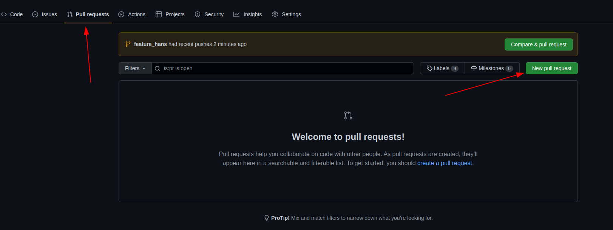
    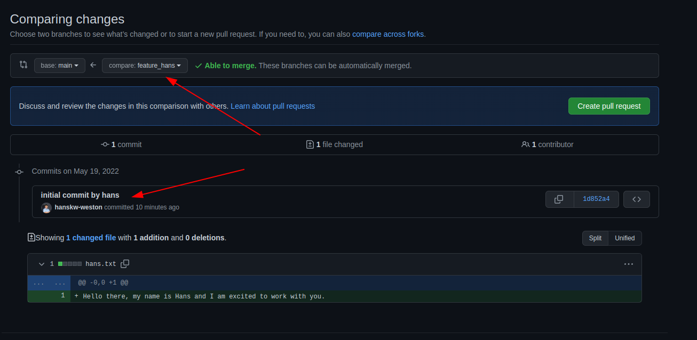
   9. From this newly created *pull request*, get another member to *review and approve* the merge and merge your commits to the main branch. *NOTE: you can always reject a pull request if something is wrong*
4. **TAKE A BREAK: Wait for all your members to complete task 1 before continuing**{: .label .label-yellow}

### **Task 2: Working with Git as a team**{: .label .label-green}

In the previous task, we have seen how we can individually make changes to our files and commit them onto a shared remote repository. However, we have glossed over a detail in the workflow...

**What if several people created/made changes to the same file/code? How would git know which code to use?**

Well.. that situation is what we call a *merge conflict*, when git does not know how to merge 2 bits of code correctly.

1. **Task 2a**{: .label .label-blue}Now that everyone has merged their changes in the main branch, view the commit history of the main branch and include a screenshot in your report.
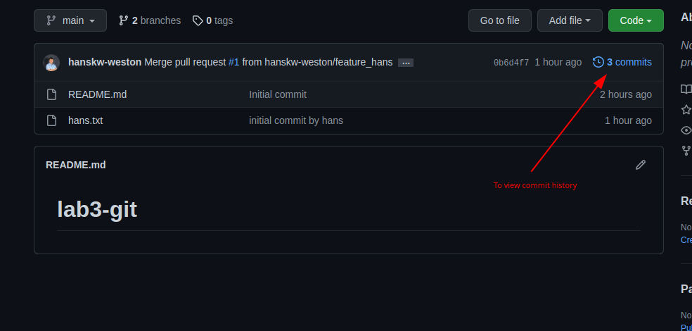
2. Now on your local repo, checkout to the main branch and run the command below. The log outputs before and after the pull should reflect any changes to the git history for that branch.
    ```bash
    git log
    git pull
    git log
    ```
   1. **Task 2b**{: .label .label-blue}We ran *git pull* to get changes from the remote main branch into our local main branch. What command is used if we just want to **check** for changes but not get those changes?
3. Now from the main branch, make and checkout a new branch called "feature_readme_< member name >"
4. Your README file should only contain the repo's name at the moment, under this title, write ur name and a few lines on what you expect to learn from this course (or anything else you want to feedback so far) and save the README.
5. Now stage, *commit* and *push* your changes to the remote repository and create a new *merge request* to the main *branch*.
6. Now for each *merge attempt* after the first merge, github should now warn that there is now a conflict and we would have to resolve it before it can merge.  
***NOTE: Please coordinate among your members when merging***
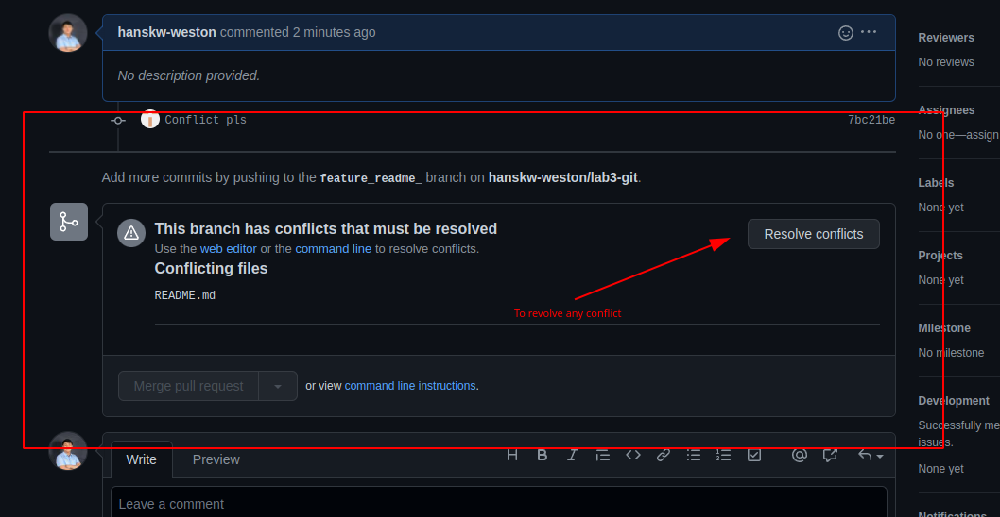
7. When you click the resolve button, you will see a similar screen to this
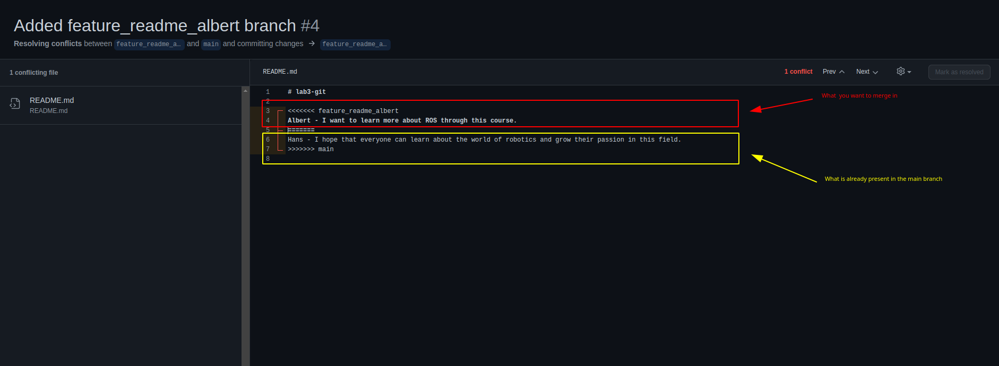
8. To resolve the conflict, edit the text to the desired text, making sure to remove the lines with arrows and equals added by git. After which mark the conflict as resolved and *commit* the merge.
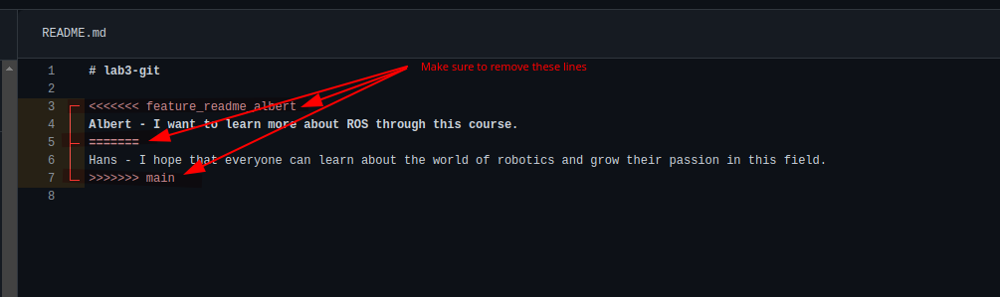
Final desired text
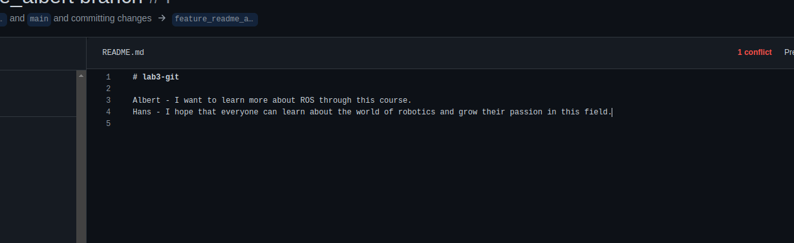
9. Repeat this step until all members have merged in their changes.
10. **Task 2c**{: .label .label-blue}Include a screenshot of the remote main branch's commit history, and the url of your remote repository in your report.

## Mini-project
To put what we have learnt into practice, each team will now attempt a "mini-project" of sorts. The end result of this mini-project should be in one shared remote repository (private or public, up to you) on github. How the work is split up among the members will be entirely up to each team.

### Background overview
The limo robot is controlled by the limo_base node. This node publishes the status of the robot using the "/limo_status" topic and the [limo_base::LimoStatus msg data format](https://github.com/westonrobot/limo_ros/blob/master/limo_base/msg/LimoStatus.msg). However, the format only outputs numerical representations of the robot status, meaning that without the correct interpretation, one cannot tell what each number actually means.

Thankfully, a description of the various values have been included in the materials provided in this lab, [LimoStatus Msg Protocol]({{ site.baseurl }}).

### **Task 3: Putting what we learnt to practice**{: .label .label-green}

1. Using the protocol given, make a ROS package (called ***limo_status_translator***) that has 2 types of nodes, details and functions given below:
   1. limo_status_translator_node
      1. Subscribe to the "/limo_status" topic.
      2. Process the message received from the "/limo_status" topic into a "human readable string"
      3. Implement a service ([.srv file]({{ site.baseurl }}) given), that will respond with the correct string depending on what was requested.
         1. e.g. if get_status = 4, that means the client is requesting for the status_string corresponding to the robot's current motion_mode
   2. limo_status_client_node
      1. Every 1 second, request the different types of strings from limo_status_translator_node and publishes the strings to 5 different topics as string msgs
         1. /limo_status/vehicle_state
         2. /limo_status/control_mode
         3. /lmo_status/battery_voltage
         4. /limo_status/error_code
         5. /limo_status/motion_mode
   3. Final result/example
    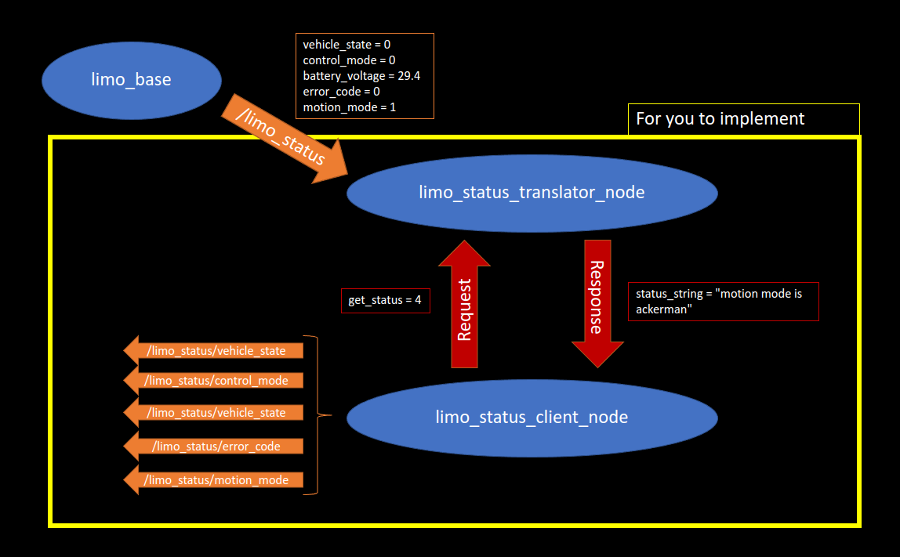
2. **Task 3a**{: .label .label-blue}Include these things in your report
   1. A short description of your contribution to the project
   2. A screenshot of the ROS network when limo_base + the 2 new nodes are running
   3. The url of your remote repository.

## Submission
Zip up your lab report and the package you have made in Task 3 into a zip file called "**lab2\_STUDENT\_ID.zip**" and submit by 28<sup>th</sup> May 2022, 23:59.