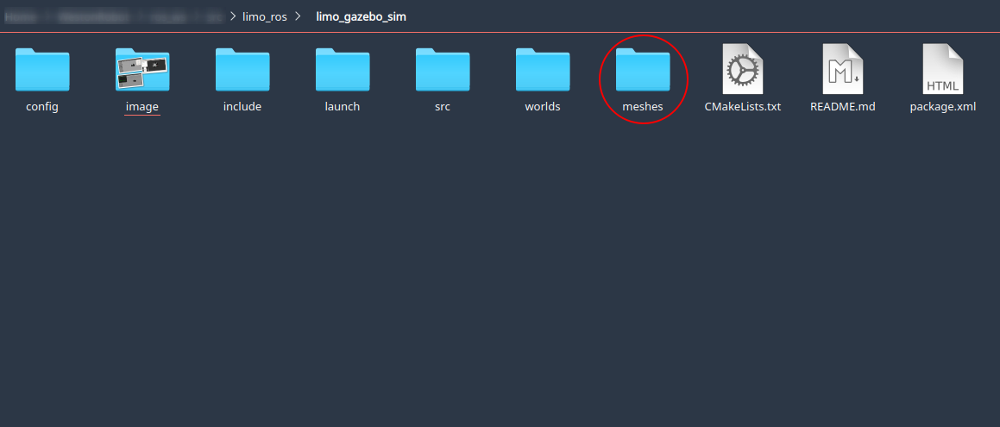
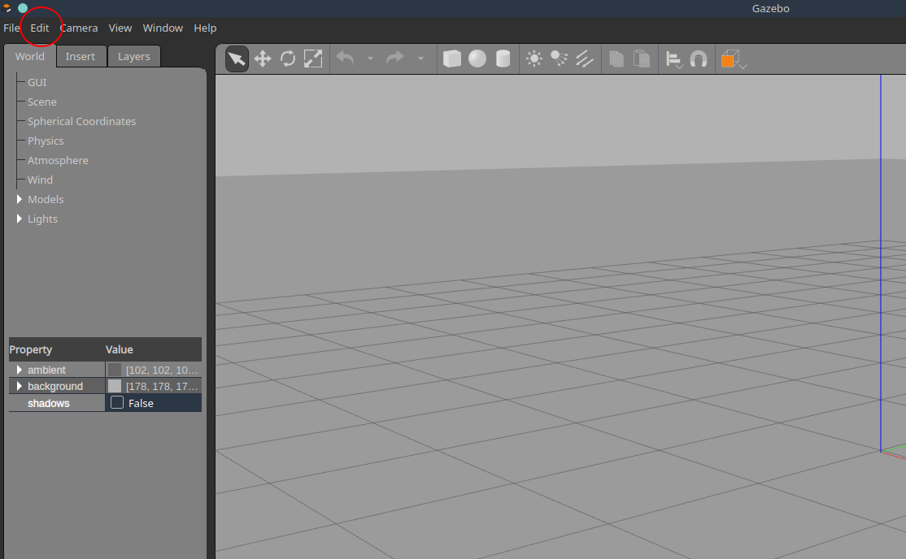
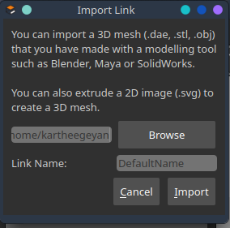
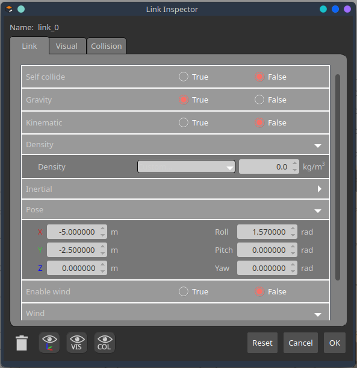
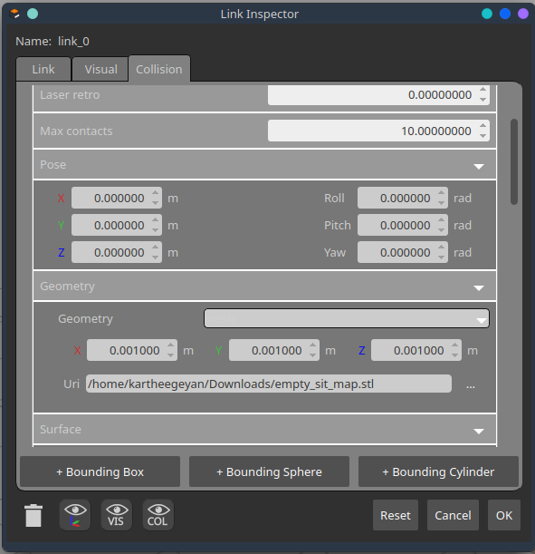
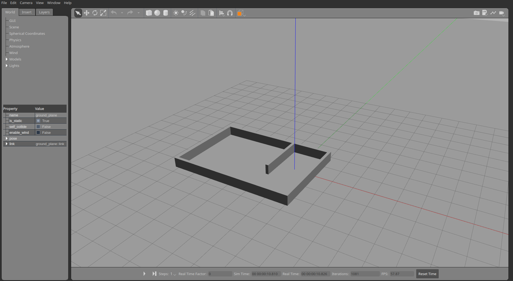
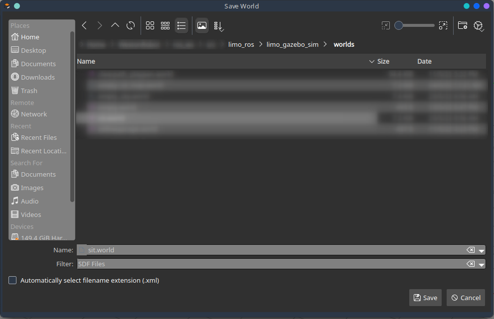

**Lab 4 submission due on 4<sup>th</sup> June 2022, 23:59**{: .label .label-red }

## Table of contents
{: .no_toc .text-delta }

- TOC
{:toc}

# Prelab (1%)
## Before lab
1. Each student must find and bring a STL model(s) you would like to import during the lab. The STL files can be shared amongst group members when importing multiple models.
2. Organisation owners should fork [WestonRobot/Limo_ros](https://github.com/westonrobot/limo_ros) repository into your groups' github organisation. Following that, each member of the organisation will fork that repository into your own personal github accounts.

## Start of Lab
1. We will have a short MCQ quiz on concepts that have been covered in the lecture and those that will be needed during this lab session, concepts covered will be from the readings found below.

## Readings
1. [Limo - Lidar Mapping](https://github.com/agilexrobotics/limo-doc/blob/master/Limo%20user%20manual(EN).md#5-lidar-mapping)
2. [Limo - Lidar Navigation](https://github.com/agilexrobotics/limo-doc/blob/master/Limo%20user%20manual(EN).md#6-lidar-navigation)
3. [TF - tf2 Overview](http://wiki.ros.org/tf2/Tutorials)
4. [ROS Navigation - Setup](http://wiki.ros.org/navigation/Tutorials/RobotSetup)
5. [Gazebo - ROS Integration](https://classic.gazebosim.org/tutorials?tut=ros_overview)

## Materials
1. [YDLidar - ROS package](https://github.com/YDLIDAR/ydlidar_ros)
2. [empty_sit_map.stl]({{ site.baseurl }}) 

----

# Setup
* Be in your teams of 5
* Tasks & report should be performed by all **group members individually** unless told otherwise.

## Lab Report and Submission
* Throughout this lab, there are tasks that you are supposed to perform and record observations/deductions.
* You can share common experimental data, but not explanations, code or deductions for the lab report.
* Discrepancies between report results and code submissions are liable for loss of marks.
* Each task will be clearly labelled and will need to be included in your lab report, which is in the format "**lab4\_report\_<STUDENT\_ID>.doc / pdf**", include your name, student_id at the begining of the report.
* Zip up your lab report and other requirements (if present) and name it "**lab4\_<STUDENT\_ID>.zip**" and upload it.

## Learning Outcomes
By the end of lab 4, you will have:
1. learnt how to create your own gazebo simulation world
2. learnt how to integrate your gazebo world into ROS
3. learnt how to perform mapping of your simulation world

----

# Lab 4 (4%) 

## Creating a Gazebo world
### **Task 1: Importing Models**{: .label .label-green}
Gazebo simulation can only use STL, OBJ or Collada (DAE) file formats for imported models. 
For simplicity, this lab will only require the groups to work with STL files. The STL file found under Materials will serve as the base for your simulation where you will be importing your own models on to.

1. Now that we have an empty world, we can start adding 3d models.
    1. Create directory called "meshes" in the limo_gazebo_sim package. 
    2. Download the empty_sit_map.stl file found under Materials and save it to the /meshes directory.

        

2. To import any model into gazebo, you will need a .world file. For this lab we will be using the empty.world file that can be found in the limo_gazebo_sim package. 

    1. From the /worlds directory within limo_gazebo_sim package run 

        ```bash
        gazebo empty.world
        ```
    2. Under 'Edit' select 'Model Editor' or press the shortcut keys Ctrl + M.

        

    3. In the model editor, click on 'Add' and change the link name to sit_map before importing the empty_sit_map.stl. 

        

    4. Do not be alarmed by the size of the imported model. The large size of the model is due to the mismatch in standard units used by Gazebo and CAD software. Go ahead and place the model anywhere in the gazebo world.

3. To scale the model down to the appropriate size, right click on the model and select 'Open Link Inspector'. This pop-up will allow you to change physical properties and geometry related to the link, visual and collision.

    1. Under the 'link' tab, set the pose of the model to 
        
        ```
        x = -5.00, y = -2.50, z = 0.00, roll = 1.57, pitch = 0.00, yaw = 0.00
        ```
        

    2. Under the 'visual' tab, set the geometry of the model to 

        ```
        x = 0.001, y = 0.001, z = 0.001, roll = 0.00, pitch = 0.00, yaw = 0.00
        ```
        

    3. Under the 'collision' tab, set the geometry of the model to 

        ```
        x = 0.001, y = 0.001, z = 0.001, roll = 0.00, pitch = 0.00, yaw = 0.00
        ```
        

    4. Under 'file' save the model in a folder of your choice and exit the model editor. The final result should be something similar to the image below.

        
    
    5. Now that you have successfully imported the model into gazebo, save the world in the /worlds directory under limo_gazebo_sim and name it **sit.world**.

        

4. Now that you are familiar with the whole process, import **at least 3 models** into the gazebo world you have just created. Within your own groups share the STL models that you and your groupmates have found before coming to the lab.

### **Task 2: Saving & Launching Worlds**{: .label .label-green}

1. For ease of collaboration in the future, it is important to change the absolute path of the models included in your .world file to a relative path, so that others can also use your gazebo environments without editing.

    To achieve this, gazebo needs to know where the STL file is saved with respect to the root folder. Gazebo simulation has specific environment variables that can be defined by users to simplify this process. Include the following lines into the package.xml file found within the limo_gazebo_sim package.

    ```xml
    <export>
        <gazebo_ros gazebo_model_path="${prefix}/meshes"/>
        <gazebo_ros gazebo_media_path="${prefix}/meshes"/>
    </export>  
    ```
2. Open the sit.world file and search for \<model name='empty_sit_map' \> tag. Under this tag you will find the \<uri\> tag that specifies the path of your model. Change that to 

    ```xml
    <uri>model://empty_sit_map.stl</uri>
    ```

    *Note: There are 2 instances of the path within the file that needs to be changed. Please also be mindful of the indentations.*

3. To launch the Limo simulation in your new gazebo environment, you will need to specify your world file in the **limo_ackerman.launch** and **limo_four_diff.launch** files. In the launch file you will find the line 

    ```xml
    <arg name="world_name" default="$(find limo_gazebo_sim)/worlds/empty.world/>
    ```

    This line sets the world file that will be used when the simulation is launched. Hence we will need to change it to 

    ```xml
    <arg name="world_name" default="$(find limo_gazebo_sim)/worlds/sit.world/>
    ```

4. Now you are ready to launch the simulation.

    ```bash
    roslaunch limo_gazebo_sim limo_ackerman.launch
    ```

## Using a Gazebo world
### **Task 3: Mapping a simulation world**{: .label .label-green}


## Submission
Zip up your lab report into a zip file called "**lab4\_<STUDENT\_ID>.zip**" and submit by 4<sup>th</sup> June 2022, 23:59.