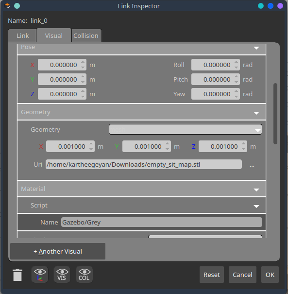
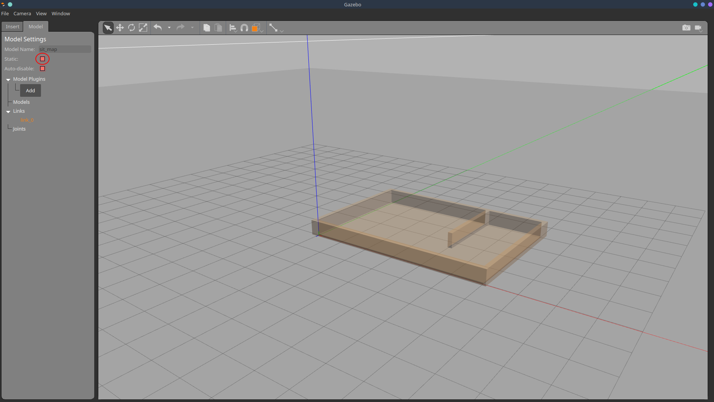

**Lab 4 submission due on 4<sup>th</sup> June 2022, 23:59**{: .label .label-red }

## Table of contents
{: .no_toc .text-delta }

- TOC
{:toc}

# Prelab (1%)
## Before lab
1. Each student must find and bring a STL model(s) you would like to import during the lab. The STL files can be shared amongst group members when importing multiple models.
2. Organisation owners should fork [WestonRobot/Limo_ros](https://github.com/westonrobot/limo_ros) repository into your groups' github organisation. Following that, each member of the organisation will fork that repository into your own personal github accounts.

## Start of Lab
1. We will have a short MCQ quiz on concepts that have been covered in the lecture and those that will be needed during this lab session, concepts covered will be from the readings found below.

## Readings
1. [Limo - Lidar Mapping](https://github.com/agilexrobotics/limo-doc/blob/master/Limo%20user%20manual(EN).md#5-lidar-mapping)
2. [Limo - Lidar Navigation](https://github.com/agilexrobotics/limo-doc/blob/master/Limo%20user%20manual(EN).md#6-lidar-navigation)
3. [TF - tf2 Overview](http://wiki.ros.org/tf2/Tutorials)
4. [ROS Navigation - Setup](http://wiki.ros.org/navigation/Tutorials/RobotSetup)
5. [Gazebo - ROS Integration](https://classic.gazebosim.org/tutorials?tut=ros_overview)
6. [ROS Navigation - Map Building](http://wiki.ros.org/pr2_simulator/Tutorials/BuildingAMapInSimulation)
7. [ROS - Topic Remapping](http://wiki.ros.org/Remapping%20Arguments)
8. [ROS - Launch Topic Remapping](http://wiki.ros.org/roslaunch/XML/remap)

## Materials
1. [YDLidar - ROS package](https://github.com/YDLIDAR/ydlidar_ros_driver) *Note this package is slightly different fom the package already present in your limo robot, the package present in your limo is currently not available on github*
2. [empty_sit_map.stl]({{ site.baseurl }}) 

----

# Setup
* Be in your teams of 5
* Tasks & report should be performed by all **group members individually** unless told otherwise.

## Lab Report and Submission
* Throughout this lab, there are tasks that you are supposed to perform and record observations/deductions.
* You can share common experimental data, but not explanations, code or deductions for the lab report.
* Discrepancies between report results and code submissions are liable for loss of marks.
* Each task will be clearly labelled and will need to be included in your lab report, which is in the format "**lab4\_report\_<STUDENT\_ID>.doc / pdf**", include your name, student_id at the begining of the report.
* Zip up your lab report and other requirements (if present) and name it "**lab4\_<STUDENT\_ID>.zip**" and upload it.

## Learning Outcomes
By the end of lab 4, you will have:
1. learnt how to create your own gazebo simulation world
2. learnt how to integrate your gazebo world into ROS
3. learnt how to perform mapping of your simulation world

----

# Lab 4 (4%) 

## Creating a Gazebo world
### **Task 1: Importing Models**{: .label .label-green}
Gazebo simulation can only use STL, OBJ or Collada (DAE) file formats for imported models. 
For simplicity, this lab will only require the groups to work with STL files. The STL file found under Materials will serve as the base for your simulation where you will be importing your own models on to.

1. Create directory called "meshes" in the limo_gazebo_sim package. 
    1. Download the empty_sit_map.stl file found under Materials and save it to the /meshes directory.

        

2. To import any model into gazebo, you will need a .world file. For this lab we will be using the empty.world file that can be found in the limo_gazebo_sim package. 

    1. From the /worlds directory within limo_gazebo_sim package run 

        ```bash
        gazebo empty.world
        ```
    2. Under 'Edit' select 'Model Editor' or press the shortcut keys Ctrl + M.

        

    3. In the model editor, click on 'Add' and change the link name to sit_map before importing the empty_sit_map.stl. 

        

    4. Do not be alarmed by the size of the imported model. The large size of the model is due to the mismatch in standard units used by Gazebo and CAD software. Go ahead and place the model anywhere in the gazebo world.

3. The imported model is also called a link in gazebo. A physical link in the simulation contains inertia, visual and collision properties. To edit the model, right click on the model and select 'Open Link Inspector'. The pop-up will allow you to change physical properties and geometry related to the link, visual and collision.

    1. Lets set the pose of the model to the perimeters below so that the limo model can be generated at the global origin without any collision for the second part of the lab.

     
    
    ```
    x = -5.00, y = -2.50, z = 0.00, roll = 1.57, pitch = 0.00, yaw = 0.00
    ```

    

    **Task 1a**{: .label .label-blue}What does the link of a model define in gazebo? Use relevant sub-properties to explain. 

    2. The visual perimeters allow users to edit the overall appearance of the model. Properties such as colour, material, texture and size can be changed according to the user's needs. 
    
        1. The imported model is scaled up due to Gazebo's default unit of measurement being metres, while the default unit of measurement for CAD software is millimeters. Hence, we need to scale down the model by 1000. Under the 'visual' tab, set the geometry of the model to 

        ```
        x = 0.001, y = 0.001, z = 0.001, roll = 0.00, pitch = 0.00, yaw = 0.00
        ```

        

    3. The collision tab defines properties such as friction, bounce and contact perimeters. The yellow frame you see in the gazebo model editor indicates the area of collision when running simulations. Similar to the visual property, the collision area also needs to be scaled down by 1000. Set the geometry of the model to 

        ```
        x = 0.001, y = 0.001, z = 0.001, roll = 0.00, pitch = 0.00, yaw = 0.00
        ```
        

        1. **Task 1b**{: .label .label-blue}What will happen if the visual property is scaled to 0.0005 instead of 0.001? What impact will the difference in scaling have when simulating the teleoperation of the Limo in the gazebo environment?

        2. **Task 1c**{: .label .label-blue}How are visual and collision related to link?

    4. Select the 'Model' tab and check the 'static' box. When a model is set to be static, it becomes immovable. Gazebo's dynamics engine will not update its position.

        

    5. Under 'file' save the model in a folder of your choice and exit the model editor. The final result should be something similar to the image below.

        
    
    6. You have successfully imported the model into gazebo, save the world in the /worlds directory under limo_gazebo_sim and name it **sit.world**.

        

4. Now that you are familiar with the whole process, import **at least 3 models** into the gazebo world you have just created. Within your own groups share the STL models that you and your groupmates have found before coming to the lab.

### **Task 2: Saving & Launching Worlds**{: .label .label-green}

1. For ease of collaboration in the future, it is important to change the absolute path of the models included in your .world file to a relative path, so that others can also use your gazebo environments without editing.

    To achieve this, gazebo needs to know where the STL file is saved with respect to the root folder. Gazebo simulation has specific environment variables that can be defined by users to simplify this process. Include the following lines into the package.xml file, **within the \<package\> tag**. Edit the package.xml file found within the limo_gazebo_sim package.

    ```xml
    <export>
        <gazebo_ros gazebo_model_path="${prefix}/meshes"/>
        <gazebo_ros gazebo_media_path="${prefix}/meshes"/>
    </export>  
    ```

2. Open the sit.world file and search for \<model name='sit_map' \> tag. Under this tag you will find the \<uri\> tag that specifies the path of your model. Change that to 

    ```xml
    <uri>model://sit_map.stl</uri>
    ```

    *Note: There are 2 instances of the path within the file that needs to be changed. Please also be mindful of the indentations.*

    1. **Task 2a**{: .label .label-blue}What is the **absolute** path of your STL model

    2. **Task 2b**{: .label .label-blue}Why are there 2 instances where the model path is defined?

3. To launch the Limo simulation in your new gazebo environment, you will need to specify your world file in the **limo_ackerman.launch** and **limo_four_diff.launch** files. In the launch file you will find the line 

    ```xml
    <arg name="world_name" default="$(find limo_gazebo_sim)/worlds/empty.world"/>
    ```

    This line sets the world file that will be used when the simulation is launched. Hence we will need to change it to 

    ```xml
    <arg name="world_name" default="$(find limo_gazebo_sim)/worlds/sit.world"/>
    ```

4. Now you are ready to launch the simulation.

    ```bash
    roslaunch limo_gazebo_sim limo_ackerman.launch
    ```

    ```bash
    rosrun teleop_twist_keyboard teleop_twist_keyboard.py
    ```

## Using a Gazebo world
### **Task 3: Mapping a simulation world**{: .label .label-green}
Now that you have a working simulation world, we can now start over first dive into the ROS navigation stack. The ROS navigation stack is a 2D navigation stack, meaning it does its job while only considering a 2d world/map. Essentially, the ROS navigation stack has these parts to allow autonomous navigation...
1. Map data of the surrounding environment (not always required)
2. Sensor data (typically but not limited to lidar)
3. Transforms (or tfs)
4. Planners and controllers

Today we will take a look at building a map using the simulation world you have made with the slam_gmapping node within the gmapping package. To build a map, we require environment data from sensors (lidar laserscan in this case)

1. Run the simulation world using the launch file you have edited in Task 2.
2. **Task 3a**{: .label .label-green}
   1. Include a screenshot of the ROS Network in your report.
   2. What topic name is the lidar laserscan data being published under?
3. Now we can run the slam_gmapping node to build the map,
    ```bash
    roslaunch limo_bringup limo_gmapping.launch
    ```

4. **Task 3b**{: .label .label-green}
   1. Include a screenshot of the ROS Network in your report.
   2. What topic name is the slam_gmapping node subscribed to for laserscan data?
5. **Task 3c**{: .label .label-green}From task 3a and 3b answers and the rviz window, can you infer what has happened to the map building process and what might be the problem?
6. **Task 3d**{: .label .label-green}Fix the problem by modifying the limo gmapping launch file and build a full map of your environment by driving your limo around in the simulation, stopping once in awhile to build a section of the map (the resultant map should be tidy and clean). Describe what you did to fix the problem in your report.
7. **Task 3e**{: .label .label-green}
   1. We can now save the map by running
        ```bash
        rosrun map_server map_saver -f <map_name>
        ```
   2. This should have generated a *.pgm* and *.yaml* file representing the map in the directory you have ran the command. Include these 2 files and the modified limo_ros package in your submission. 

**EXTRA (Not Graded): Try mapping your classroom using your LIMO, (*using limo_start.launch in limo_bringup instead of the simulation launch file*).**


## Submission
Zip up your lab report into a zip file called "**lab4\_<STUDENT\_ID>.zip**" and submit by 4<sup>th</sup> June 2022, 23:59.