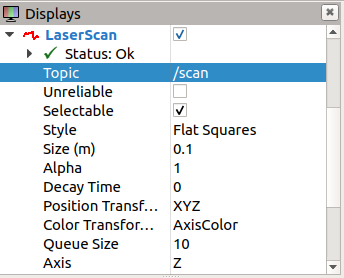

**Lab 5 submission due on 11<sup>th</sup> June 2022, 23:59**{: .label .label-red }

## Table of contents
{: .no_toc .text-delta }

- TOC
{:toc}

# Prelab (1%)

## Start of Lab
1. We will have a short MCQ quiz on concepts that have been covered in the lecture and those that will be needed during this lab session, concepts covered will be from the readings found below.

## Readings
1. [ROS Navigation - Setup](http://wiki.ros.org/navigation/Tutorials/RobotSetup)
2. [ROS Navigation - AMCL](http://wiki.ros.org/amcl)
3. [ROS Navigation - Move_base](http://wiki.ros.org/move_base)
4. [ActionLib - Python Tutorials](http://wiki.ros.org/actionlib_tutorials/Tutorials)
5. [ROS Navigation - Map_Server](http://wiki.ros.org/map_server)

## Materials

----

# Setup
* Be in your teams of 5
* Tasks & report should be performed by all **group members individually** unless told otherwise.

## Lab Report and Submission
* Throughout this lab, there are tasks that you are supposed to perform and record observations/deductions.
* You can share common experimental data, but not explanations, code or deductions for the lab report.
* Discrepancies between report results and code submissions are liable for loss of marks.
* Each task will be clearly labelled and will need to be included in your lab report, which is in the format "**lab5\_report\_<STUDENT\_ID>.doc / pdf**", include your name, student_id at the begining of the report.
* Zip up your lab report and other requirements (if present) and name it "**lab5\_<STUDENT\_ID>.zip**" and upload it.

## Learning Outcomes
By the end of lab 5, you will have:
1. learnt how to navigate using amcl/move_base
2. learnt how to provide waypoints to move_vase using a node

----

# Lab 5 (5%) 

## Single Waypoint Navigation
### **Task 1: Navigation using amcl & move_base**{: .label .label-green}
Basic navigation using ROS navigation stack in created Gazebo world. We will be using the modified launch file and map you have made in lab 4.


1. Load Gazebo virtual environment and map
    1. Launch Gazebo simulation
        
        ```bash
        roslaunch limo_gazebo_sim limo_four_diff.launch
        ```

    2. In another terminal, load map using map_server ros package

        ```bash
        rosrun map_server map_server <path-to-map-yaml-file>
        ``` 
2. Launch navigation
    1. In another terminal, launch navigation launch file 

        ```bash
        roslaunch limo_bringup limo_navigation_diff.launch
        ```

    2. LaserScan in RViz will not display anything as it is not subscribing to the correct topic. Change to "/limo/scan"

     

3. Initial pose estimate and single point navigation using RViz
    1. AMCL requires an intial starting position, we can define this starting position using the RViz interface. At the top of RViz window, click "2D Pose Estimate". 
    2. On the map, click and hold left mouse click at estimated location of Limo. 
    3. After setting the intial pose, we can then publish a goal for the Limo to navigate to. At the top of RViz window, click "2D Nav Goal". 
    4. On the map, click and hold left mouse click at targeted location. 

**Task 1a**{: .label .label-blue}What topics do "2D Pose Estimate" and "2D Nav Goal" publish to and what are the message types? What are purposes of these topics?

**Task 1b**{: .label .label-blue}With reference to the tasks in the previous lab, briefly explain why there are two available topics for LaserScan.

**Task 1c**{: .label .label-blue}You will see 3 Map topics on the left window pane in the RViz, yet you only loaded one map, briefly describe what they are. 

**Task 1d**{: .label .label-blue}Similarly, you will see 2 Path topics on the left window pane in the RViz, yet the robot only follows one path, briefly describe what they are. 

**Task 1e**{: .label .label-blue}Which published topics from move_base can you use to check whether the robot has reached the navigation goal? Hint: refer to [move_base](http://wiki.ros.org/move_base) documentation and use the "rosmsg show" command.  

**Optional Task**{: .label .label-blue}Instead of typing out the command to load the map each time, we have multiple ways to streamline this task. One such method is the roslaunch feature. Edit the navigation launch file to run the map server node. 

## Multi Waypoint Navigation
### **Task 2: Navigation using a node**{: .label .label-green}
Now that you have successfully navigated the limo through a known map, one way-point/goal at a time using rviz and learnt how move_base receives/feedbacks its navigation goals/status.

In this task, you would have to navigate the limo through multiple way-points one after another using your own custom node in its own package. 

#### **Node description**
* Your package should be called "limo_navigator"
* Your node should be called "limo_navigator_node"
* Your node should follow the behaviour described below
   * Send a way-point to move_base to navigate to.
   * Wait till limo has reached the way-point (or deemed it has failed).
   * Send the next way-point in the list.
   * Repeat till limo has reached the last way-point.

1. **Task 2a**{: .label .label-green}Pick 4 way-points anywhere within your map, list these in your report.
2. **Task 2b**{: .label .label-green}Create your custom node in its own package (behaviour listed above).
3. **Task 2c**{: .label .label-green}Create a launch file that launches your node along with the navigation setup (i.e. by launching using this file, your limo should start navigating to your waypoints automatically)
4. **Task 2d**{: .label .label-green}Include the limo_ros package you have been using in this lab and your custom package with launch file (from task 2b & 2c) with your report. (Make sure that they are full packages that can be run)


## Submission
Zip up your lab report into a zip file called "**lab5\_<STUDENT\_ID>.zip**" and submit by 11<sup>th</sup> June 2022, 23:59.