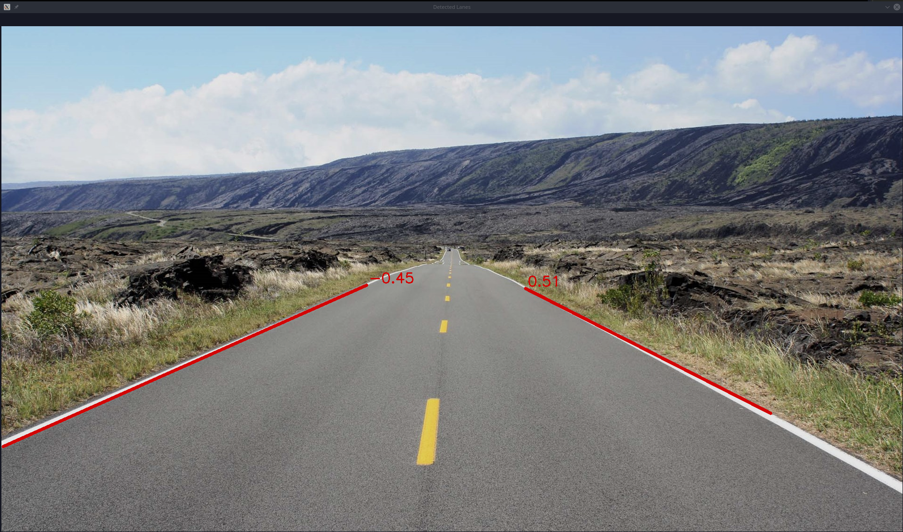

**Lab 7 submission due on 2<sup>nd</sup> July 2022, 23:59**{: .label .label-red }

## Table of contents
{: .no_toc .text-delta }

- TOC
{:toc}

# Prelab (1%)

## Start of Lab
1. We will have a short MCQ quiz on concepts that have been covered in the lecture and those that will be needed during this lab session, concepts covered will be from the readings found below.

## Readings
1. [LIMO Guide - Depth Camera + LiDAR](https://github.com/agilexrobotics/limo-doc/blob/master/Limo%20user%20manual(EN).md#7-depth-camera--lidar-mapping)
2. [ROS - rosparam](http://wiki.ros.org/rosparam)
3. [OpenCV - Canny Edge Detector](https://docs.opencv.org/4.1.1/da/d5c/tutorial_canny_detector.html)
4. [OpenCV - Hough Line Detector](https://docs.opencv.org/4.1.1/d9/db0/tutorial_hough_lines.html)
5. [OpenCV - Image Smoothing](https://docs.opencv.org/4.1.1/d4/d13/tutorial_py_filtering.html)

## Materials
1. [Colour Test Image]({{ site.baseurl }})
2. [Colour Venn Diagram]({{ site.baseurl }})
3. [Road Lane Image]({{ site.baseurl }})
4. [Camera Adapter Mount Stp File]({{ site.baseurl }})

----

# Setup
* Be in your teams of 5
* Tasks & report should be performed by all **group members individually** unless told otherwise.

## Lab Report and Submission
* Throughout this lab, there are tasks that you are supposed to perform and record observations/deductions.
* You can share common experimental data, but not explanations, code or deductions for the lab report.
* Discrepancies between report results and code submissions are liable for loss of marks.
* Each task will be clearly labelled and will need to be included in your lab report, which is in the format "**lab7\_report\_<STUDENT\_ID>.doc / pdf**", include your name, student_id at the beginning of the report.
* Zip up your lab report and other requirements (if present) and name it "**lab7\_report\_<STUDENT\_ID>.doc / pdf**" and upload it.

## Learning Outcomes
By the end of lab 7, you will have:
1. Learnt how to start and subscribe to a video stream from limo's camera
2. Manipulate and analyze images using OpenCV

----

# Lab 7 (4%)
Before starting with any of the task below, set your network so that each student's computer can communicate with your LIMO through a local network. (Refer to lab 2 task 2)

## Working with Images + ROS
Each of your limo is equipped with a forward facing camera mounted on its "head". The ROS driver (astra_camera) needed to run this camera has already been loaded onto the "~/agilex_ws" catkin workspace on the jetson nano's home folder.

### **Task 1: Starting the camera stream**{: .label .label-green}
For this task, you will need to utilise the image stream from your LIMO's camera. The camera's ROS driver mentioned above publishes the different types of "images" from the camera over the ROS network. We are mainly interested in the RGB image stream.

* **Task 1a**{: .label .label-blue}Source the agilex_ws setup.bash and run the camera driver using the command below, include an image of the resultant ROS network from your computer in your report.
  ```bash
  roslaunch astra_camera dabai_u3.launch
  ```
* **Task 1b**{: .label .label-blue}When running, this driver dynamically creates parameters that are exposed to the ROS network.
  * What parameters are used to state the height and width of the image captured?
  * We can change these parameters using several methods, state 2 methods to do so.
* **Task 1c**{: .label .label-blue}Out of all the different image streams published we are mainly interested in 2; "/camera/rgb/image_raw" & "/camera/rgb/image_raw/compressed". What are the data formats used to publish these 2 topics?

### **Task 2: Utilising the camera stream**{: .label .label-green}
For this task, you will need to write a node in its own package that subscribes and displays the "/camera/rgb/image_raw" image stream in its own window.

#### **Node description**
* Your package should be called "limo_pov"
* Your node should be called "limo_pov_node"
* Your node should follow the behaviour described below
   * Subscribe to "/camera/rgb/image_raw" topic
   * For each image in the stream, display it in a window called "LIMO POV" using OpenCV's "imshow" function

1. **Task 2a**{: .label .label-blue}Create your custom node in its own package (behaviour listed above).
2. **Task 2b**{: .label .label-blue}Create a launch file to launch limo_pov_node.
3. **Task 2c**{: .label .label-blue}In what color space is this image stream in? (you can use the colour test image provided)
4. **Task 2d**{: .label .label-blue}Convert this image stream to a "GRB" colour space and display this new image in another window called "LIMO's WACKY POV".

## Working with Images

### **Task 3: Extracting Colours**{: .label .label-green}
The different combinations of the primary colours in the RGB colour space gives us a total of 6 primary/secondary colours which are
* Red
* Green
* Blue
* Yellow
* Cyan
* Magenta

1. **Task 3a**{: .label .label-blue}The colour_test_img.png image have what are known as "pure" colours, meaning they only have the component colours necessary to make that colour. Create a python script called pure_color_extractor.py and include this script with your report. This script should
   1. Read the given colour_test_img.png image.
   2. Extract each of the 6 colours listed above
   3. Display each extracted colour on its own window (Total 7 including the original) named after the color. An example showing extracted red is shown below.


2. **Task 3b**{: .label .label-blue}However, images from the real world rarely so, having a mix of colours at different intensities but are still considered a specific colour. This can be the result of lighting, camera parameters, etc. We will use the colour_venn_diagram.jpg image as an example of this. Create a python script called mixed_color_extractor.py and include this script with your report. This script should
   1. Read the given colour_venn_diagram.jpg image.
   2. Extract each of the 6 colours listed above
   3. Display each extracted colour on its own window (Total 7 including the original) named after the color. An example showing extracted red is shown below.


### **Task 4: Detecting lines**{: .label .label-green}
Sometimes we need to be able to extract/detect certain features in a image using opencv (shapes, line, etc). For this lab, we will focus on detecting straight lines.

1. **Task 4a**{: .label .label-blue}Create a python script called lane_line_detector.py and include this script with your report. This script should
  1. Read the given road_lane.jpg image.
  2. Extract the 2 lane lines at either side of the road.
  3. Draw the detected lines and their slopes on the original image.
  4. Display the drawn lines image in a window called "Detected Lanes Lines". An example is shown below



1. **Task 4b**{: .label .label-blue}Elaborate on/Document your script from task 4a. You should write it in such a way that anyone reading this document will understand what you are trying to achieve and be able to replicate what you have done on any similar image. Make sure to include details on any values you have chosen, how those values affect the process and how you have arrived at those values.

## Submission
Zip up your lab report and the package/scripts you have made in Task 2/3 into a zip file called "**lab7\_<STUDENT\_ID>.zip**" and submit by 2<sup>nd</sup> July 2022, 23:59.