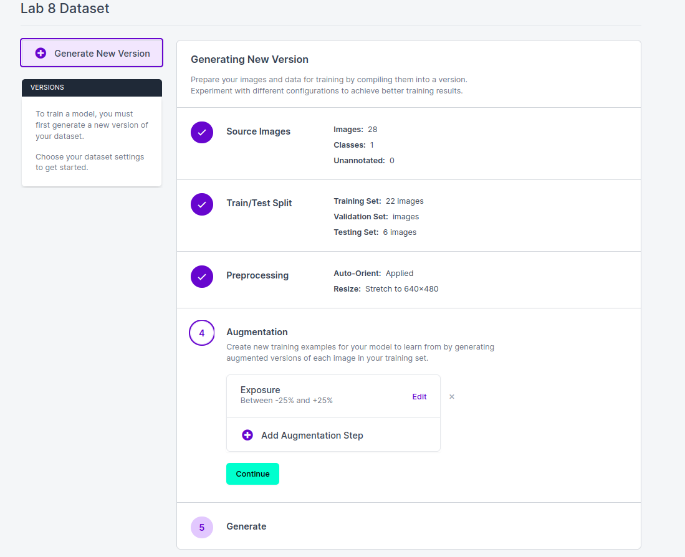

**Lab 8 submission due on 9th July 2022, 23:59**{: .label .label-red }

## Table of contents
{: .no_toc .text-delta }

- TOC
{:toc}

# Prelab (1%)

## Before Lab
1. Each Student must register for a free account with [Roboflow](https://roboflow.com/)
2. Download the Lab 8 Google Colab notebook in the Materials Section

## Start of Lab
1. We will have a short MCQ quiz on concepts that have been covered in the lecture and those that will be needed during this lab session, concepts covered will be from the readings found below.

## Readings
1. [Object Detection](https://www.fritz.ai/object-detection/)
2. [YOLO - You Only Look Once](https://docs.ultralytics.com/)
3. [Model Training & Deployment for PyTorch](https://pytorch.org/tutorials/beginner/introyt/trainingyt.html)
4. [Training Metrics](https://towardsdatascience.com/metrics-to-evaluate-your-machine-learning-algorithm-f10ba6e38234)

## Materials
1. [Lab 8 Google Colab notebook]({{ site.baseurl }})
2. [Images for training 1]({{ site.baseurl }})
3. [Images for training 2]({{ site.baseurl }})
4. [Images for training 3]({{ site.baseurl }})
5. [Images for training 4]({{ site.baseurl }})
6. [Images for training 5]({{ site.baseurl }})
7. [Images for training 6]({{ site.baseurl }})
8. [Images for training 7]({{ site.baseurl }})
9. [Images for testing inferences]({{ site.baseurl }})

----

# Setup
* Be in your teams of 5
* Tasks & report should be performed by all **group members individually** unless told otherwise.

## Lab Report and Submission
* Throughout this lab, there are tasks that you are supposed to perform and record observations/deductions.
* You can share common experimental data, but not explanations, code or deductions for the lab report.
* Discrepancies between report results and code submissions are liable for loss of marks.
* Each task will be clearly labelled and will need to be included in your lab report, which is in the format "**lab8\_report\_<STUDENT\_ID>.doc / pdf**", include your name, student_id at the beginning of the report.
* Zip up your lab report and other requirements (if present) and name it "**lab8\_report\_<STUDENT\_ID>.doc / pdf**" and upload it.

## Learning Outcomes
By the end of lab 8, you will have:
1. Learnt how to create a object detection dataset using labeling tools
2. Learnt how to train/deploy a object detection model
3. Learnt the basics of evaluating your object detection model and implementing tweaks to improve the model
4. Experience in the use of common tools/framework to do so (ie. Pytorch, Roboflow, YOLOv5....)

----

# Lab 8 (4%)
Being able to identify objects is a very important skill for robots to have in order to perform tasks in a human environment. Hence, we will build on certain concepts learnt from the previous lab and learn the basics of creating a deep learning model that can be deployed on your robots.

### **Task 1: Google Colab**{: .label .label-green}
For this lab, we have also prepared a Python jupyter notebook with sample code for how you can train and deploy your own model. Since most deep learning libraries are mainly only compatible with Python 3, we will be using Google Colab to run our notebook instead.

Google Colab is a free Jupyter notebook environment that runs entirely in the cloud service. This allows us to access Google's computing resources such as GPUs for our deep learning needs. While there is the option to upgrade to a premium version with more feature and resources, the free version will prove sufficient for our needs.

Go to the [Google Colab](https://colab.research.google.com/?utm_source=scs-index) site and upload the downloaded Lab-8 notebook. To do this, you will first need to login into your google account.

You should be able to see the notebook uploaded onto your Google Drive

To run cells in the notebook, we will need to connect to a runtime so that we can utilize the Google Cloud's computing resources. Since Deep Learning and Model Training are computationally expensive and intensive, we will be making use of the GPU hardware accelerator. These can be done with the following steps:

1. Click `Connect` to connect to a runtime

2. Select `Change Runtime type` and change the Hardware accelerator to `GPU`

With this, you should be able to run the cells in the notebook as you have done previously with the Open-CV notebook.

### **Task 2: Create your object detection dataset**{: .label .label-green}
The first step to creating our object detection model is to determine the kinds of objects that we want to identify. For this lab, we will be creating a model that is able to identify bottle caps. In future, you can experiment and train your model to identify multiple objects of other different types.

So how do we train our model to identify bottle caps? Well, let's consider the case of a student like yourself in University. How can the student get better results for their exams? The best method (although some of you might disagree) is to constantly study relevant materials and practice different kinds of questions to do well for the exams. 

Training our object detection model follows a similar concept. In order for our model to identify bottle caps accurately, we will need to give it pictures of bottle caps to study. Just like how studying more materials can give you better performance in exams, giving our model many variations of bottle caps to study will allow it to be more adept at being able to correctly identify bottle caps. Hence, our first step for model training would be to prepare our dataset for object detection.

For this lab, we have already prepared sample images for you to train your model.
1. Download the training images (1 - 7) zip file(s) under the materials section and extract the images into a single folder. These images will be used for training our object detection model.
2. Annotate the training images using labelling tools
* Our model needs to know where our bottle caps are in the images. Hence, we will need to draw bounding boxes to annotate the images and show the model where the bottle caps are located at.  

* In order to annotate our images, we can make use of various softwares to do so, some of which are listed as additional readings in the notebook. For this lab, we will be making use of [Roboflow](https://roboflow.com/) to annotate our images.

**Roboflow**

Roboflow is a platform that we can use to add and annotate image data. Also, the annotated image dataset can be augmented (we will discuss this further later on) and exported into different formats for model training. Hence, it is a convenient platform for preparing our object detection dataset.

If you haven't already done so under the Prelab section, create and login into your Roboflow account. Once logged in, the website will prompt you to run through their dataset preparation tutorial. We highly recommend that you follow the [tutorial project creation](https://blog.roboflow.com/getting-started-with-roboflow/), as we will be following the same process in order to prepare and export our dataset.

1. Create your new project and call it `Lab 8`.

2. Upload the training images that you have downloaded onto RoboFlow

3. Under the annotation section, add all images under your job, and annotate all the images with the bounding box tool. At this current moment, do not make use of the segmentation/polygon drawing tool, as our model is for identifying of objects, rather than for segmentation/classification (as explained in the lectures)

    1. Note: This step will largely manual and is likely take up the bulk of your time. Nevertheless, we do encourage students to put in effort for image annotation as poorly annotated image data can heavily impact the accuracy of your trained model

4. Once all the images have been annotated, add the images to the dataset. A prompt will request for the train-test data split. The train dataset is used to train the model, where it sees and learns from the dataset, whereas the test dataset is used to evalutate the model after training. The values to use for the dataset split can potentially impact your model training heavily. For this lab, we will be using the `80-20` split For this lab. This means that 80% of the data will fall under the train dataset, while the remaining data will fall under the test dataset.

5. After the train-test dataset split, we will be able to add preprocessing and augmentations to our image data. 

    1. Image Preprocessing is a technique that suppresses undesired distortions or enhances some image features relevant for further processing and analysis task.

        1. There are many [techniques](https://www.mygreatlearning.com/blog/introduction-to-image-pre-processing/) that you can employ for image preprocessing. For this lab, we will be adding the auto-orientate and resize (stretch to 640 x 480) steps. Re-sizing changes the pixel information of the image, where reducing an image in size will result in unneeded pixel information being discarded.

    2. Data augmentation is a technique which we can use to increase our training data, by applying variations to the images that we currently have (ie. increasing the brightness/exposure) and appending them to the dataset. This helps in creating a more robust and generalized model.

        1. There are many [techniques](https://iq.opengenus.org/data-augmentation/) that you can employ to further augment your dataset. However, due to the lack of a big dataset and time, do limit the number of augmentations to a maximum of 3 to prevent long training times for the model.

6. Once augmentations have been added, you will be able to generate a version and export the dataset in various types of formats. For this lab, we will be using the `YOLO v5 Pytorch` Format for export. Select the download code option and copy the download code into the notebook.

* **Task 2a**{: .label .label-blue} Is it important for your bounding boxes to be a tight fit for the object? Explain your answer.

* **Task 2b**{: .label .label-blue} Why did we choose to re-size our images to 640 x 480? (Instead of say 640 x 640?) Would re-sizing our images to 1280 x 960 be fine as well? (Hint - Observe the image resolutions of all the images within the dataset)

### **Task 3: Training the model**{: .label .label-green}

With the dataset prepared and (painstakingly) annotated, it is now finally time to start training our model. Upload your notebook onto Google ColabOpen up the notebook and go to the Model Training Section. Follow the instructions in the notebook on how you can train your own model. 

Ensure that you have connected to a GPU runtime before starting your model training. YOu can do so by clicking on the "Change runtime type" button and changing the hardware accelerator to GPU. Otherwise, your model training time will take a significantly longer time to complete.

Note: The notebook has been purposely written with some brevity, such that students will have to learn how to look for relevant information and approach a problem without step-by-step instructions (which is an important skill for any engineer to have). Nevertheless, most of the concepts in the notebook have been discussed and most problems that you may encounter can be solved with some googling and an understanding of the concepts discussed.

* **Task 3a**{: .label .label-blue} Go through the notebook and run your model training through 80 epochs. Leave the output in the notebook.

### **Task 4: Evaluating the trained model**{: .label .label-green}

Now that we have our newly trained model, we can make use of various training metrics to evaluate the accuracy and efficiency of our model, so that we can gain better insight on how we can improve andoptimize our model training.

Follow the instructions in the notebook to visualize your results using Tensorboard. You should be able to get the tensorBoard window to show up within the notebook

Now that we have our Tensorboard window, lets discuss some of the training metrics that it logs.

mean Average Precision (mAP) is a popular metric that tells you how precise your classifier is (how many instances it classifies correctly), as well as how robust it is (it does not miss a significant number of instances), where it computes the average precision value for recall value over 0 to 1.

Precision refers to the number of correct positive results (True Positives) divided by the number of positive results predicted by the classifier (True & False Positives), while recall refers to the number of correct positive results (True Positives) divided by the number of **all** relevant samples (True Positives & False Negatives)

* **Task 4a**{: .label .label-blue} Attach a screenshot of your tensorboard metrics window with the lab report.
* **Task 4b**{: .label .label-blue} What is the mAP value of your model when training at the 80th epoch? Does increasing the number of epochs mean that your mAP value will always increase?
* **Task 4c**{: .label .label-blue} List down any 2 ways we can use to improve the mAP value of our model. State any assumptions that you made with the methods mentioned.

### **Task 5: Exporting the Model for deployment**{: .label .label-green}

With our newly trained model, lets run some inferences on some test images in order to test out our model

1. Upload the images onto the runtime at the path `content/yolov5/data/images/` for the inference. This can be done by selecting the folder icon on the left-hand side of the page, and clicking on the `Upload` button.

* **Task 5a**{: .label .label-blue} Download the images that was run through the inference and attach the 3 images with the lab report. **They should have bounding boxes drawn on the bottle caps with a minimum accuracy of 50%**.

* **Task 5b**{: .label .label-blue} Export your model in the PyTorch format (best.pt), and put it together with the lab report.
